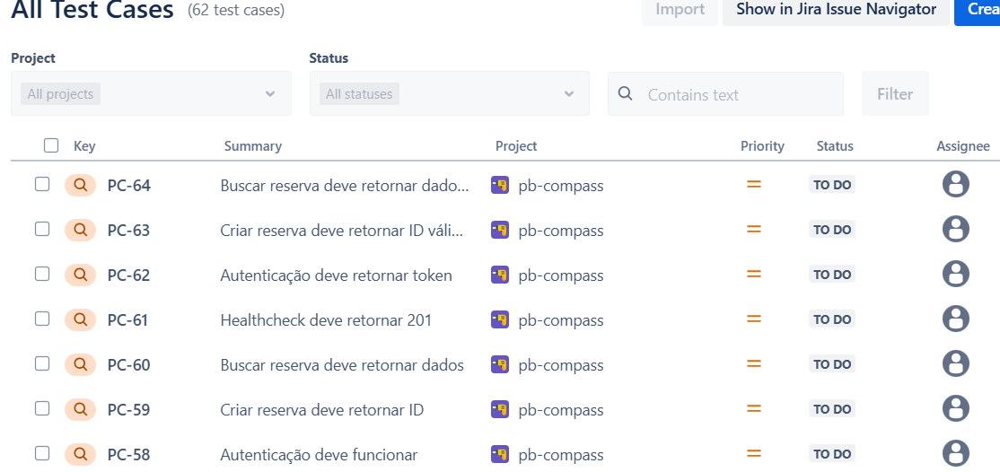
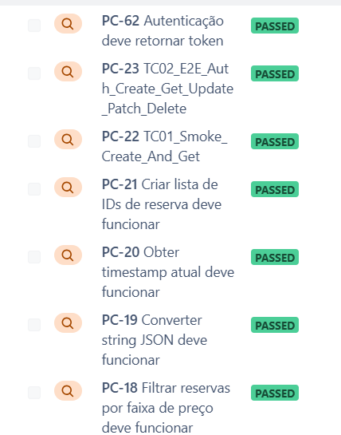

# Mudanças aplicadas no planejamento de testes — Restful-Booker (Pré-Challenge)

> Evolução do plano após o Challenge anterior, agora **focada no Restful-Booker** e na execução/gestão via **QAlity** + **Robot Framework (RequestsLibrary)**.

## 1) Resumo do que foi melhorado
- **Escopo correto**: troca de ServeRest → **Restful-Booker** (endpoints: `/ping`, `/auth`, `/booking`, `/booking/{id}` com `GET/POST/PUT/PATCH/DELETE` e filtros).
- **Rastreabilidade**: migração dos casos para **QAlity (QAlity Test)**, organização por feature e criação de **Test Cycle** para baseline.
- **Cobertura ampliada**: cenários **positivos, negativos, borda e contrato** por endpoint (incluindo filtros de busca em `/booking`).
- **Priorização explícita (Risco × Impacto)**: definição de **P1/P2/P3** para guiar a ordem de automação.
- **Padrões técnicos Robot**: sessão única, headers base, keywords `* On Session`, variáveis centralizadas e asserções claras.
- **Dados de teste**: geração dinâmica e **cleanup** idempotente dos bookings criados.
- **Qualidade de execução**: uso do `/ping` como **healthcheck** e adoção de re-tentativas/backoff em chamadas instáveis.
- **Evidências**: casos importados e **ciclo executado** no QAlity (prints ao final).

---

## 2) Cobertura por endpoint (o que foi adicionado/ajustado)
- **`/ping` (Healthcheck)**
    - ✅ Verificar disponibilidade do serviço (esperado: 2xx/201).
    - 🔁 Rodar antes dos suites (gate) — se falhar, aborta suite.
- **`/auth`**
    - ✅ Geração de token com credenciais válidas (corpo contém `token`).
    - ❌ Credenciais inválidas (mensagem de falha no body); sem token.
- **`/booking` — CRUD**
    - **POST** criar booking válido (retorna `bookingid`).
    - **GET {id}** retorna dados consistentes do booking criado.
    - **PUT {id}** atualização completa — requer token; valida todos os campos.
    - **PATCH {id}** atualização parcial — requer token; valida apenas campos alterados.
    - **DELETE {id}** remoção com token; re-consulta deve falhar/não encontrar.
    - **NEGATIVOS**: criar com payload inválido; GET com id inexistente; PUT/PATCH/DELETE sem token / token inválido.
- **`/booking` — Filtros/Busca**
    - **GET** com parâmetros (`firstname`, `lastname`, `checkin`, `checkout`) — combinações válidas.
    - **NEGATIVOS**: datas fora de formato, ranges invertidos, filtros mutuamente exclusivos.
- **Borda/Contrato**
    - Borda: tamanhos mínimos/máximos em `firstname/lastname`, datas de limite, valores nulos.
    - Contrato: presença/forma de campos nos responses (planejada validação de **schema JSON** na próxima iteração).

---

## 3) Priorização (Risco × Impacto)
- **P1 (Alta)**: `/ping`, `/auth`, `POST /booking`, `GET /booking/{id}`, `PUT/PATCH/DELETE /booking/{id}` (fluxo CRUD completo + autenticação).
- **P2 (Média)**: busca com filtros, combinações de data, validações negativas mais comuns.
- **P3 (Baixa)**: casos informativos/edge menos críticos e variações raras.

> **Regra**: Automação começa por **Smoke + P1**; depois expandimos para P2 e P3.

---

## 4) Padrões técnicos adotados (Robot Framework)
- **RequestsLibrary** com `Create Session` (uma por suíte) e `Delete All Sessions` no teardown.
- **Variáveis** centralizadas: `${BASE_URL}`, caminhos (`/booking`), timeouts, credenciais.
- **Headers base** (`Content-Type`/`Accept`: `application/json`).
- **Keywords `* On Session`**: `GET/POST/PUT/PATCH/DELETE On Session`.
- **Tratamento de erro**: asserções de **status** e de **mensagens** de erro (quando 4xx/5xx).
- **Dados**: geração dinâmica de payloads (datas atuais + offset), **cleanup** do `bookingid` criado.
- **Tagging**: `smoke`, `regression`, `p1/p2/p3`, `negative`, `filters`, `restfulbooker`.
- **Resiliência**: `Wait Until Keyword Succeeds` ou tentativas com backoff para instabilidades da API pública.
- **Rastreabilidade**: gravação do `bookingid` e link/nota para o caso no QAlity (quando aplicável).

---

## 5) Gestão e Métricas no QAlity
- Casos migrados como **QAlity Test** e organizados por feature (Booking, Auth, Healthcheck, Filtros).
- **Test Cycle** criado e executado para baseline (**status PASSED/FAILED** por caso).
- Uso do **Test execution report** para acompanhar taxa de sucesso e priorizar correções.

### Evidências

**Lista de Test Cases (62)**  

**Execução — exemplos “PASSED”**  

---

## 6) Itens que **mudaram** 
- [x] Escopo ajustado para **Restful-Booker**; revisão de todos os casos para refletir endpoints e regras desta API.
- [x] **Ampliação de cobertura**: negativos, borda e filtros de busca em `/booking`.
- [x] **Prioridade definida (P1/P2/P3)** por risco/impacto — base para ordenar automação.
- [x] **Padronização Robot** (sessão única, headers base, variáveis, keywords `On Session`, asserções claras).
- [x] **Dados idempotentes** com criação/remoção de bookings e datas geradas dinamicamente.
- [x] **Ciclo de teste** no QAlity executado para criar baseline e relatórios.
- [x] **Healthcheck pré-execução** via `/ping` como gate.
- [x] Planejamento de **validação de contrato (JSON Schema)** para próxima iteração.

